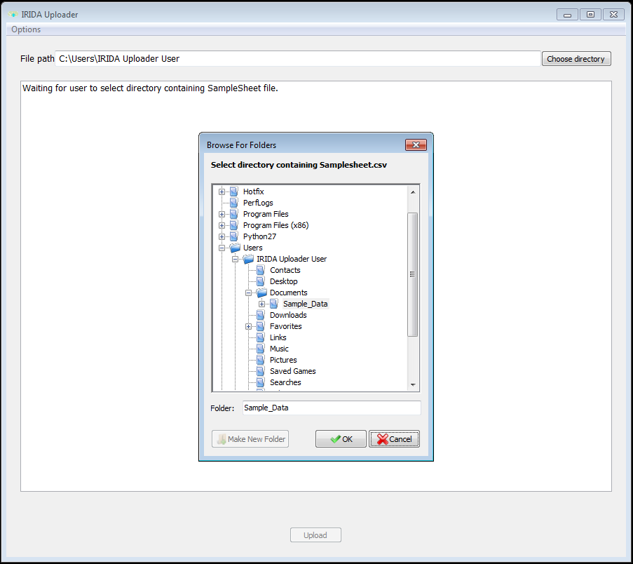

.. _basic_usage:

===========
Basic Usage
===========

.. _upload_single_seq_run:

---------------------------------
Uploading a single sequencing run
---------------------------------

1. Click the "Choose directory" button.

.. image:: _static/basic_usage/Step1.png

2. Select the directory containing the SampleSheet.csv file.

3. If the SampleSheet.csv in the directory you selected is valid then the upload button will be displayed.  
If you see an error then see :ref:`handling_errors` for more information. 

.. image:: _static/basic_usage/Step3.png

4. Click the upload button to start uploading.

.. image:: _static/basic_usage/Step4.png

5. The upload should start in a few seconds depending on your internet speed and provide you with an estimated time until it completes.

.. image:: _static/basic_usage/Step5.gif

----------------------------------
Uploading multiple sequencing runs
----------------------------------

This is very similar to the steps in :ref:`upload_single_seq_run` except for **Step 2**.  
For **Step 2**:   
Select the directory containing the sub-directories that have the SampleSheet.csv files.

Add image showing   

dir_to_select

__subdir1

__subdir2

