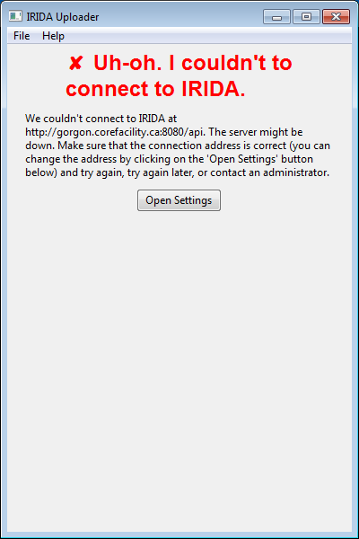
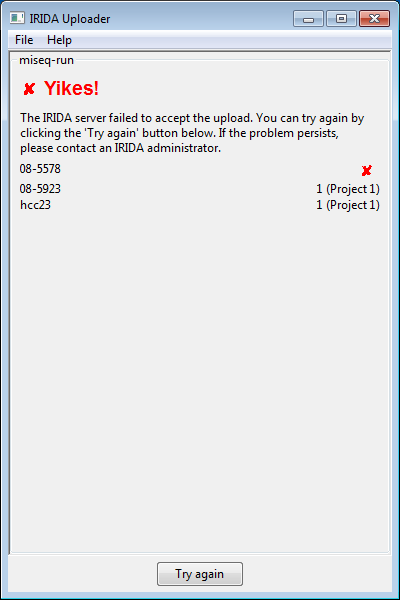
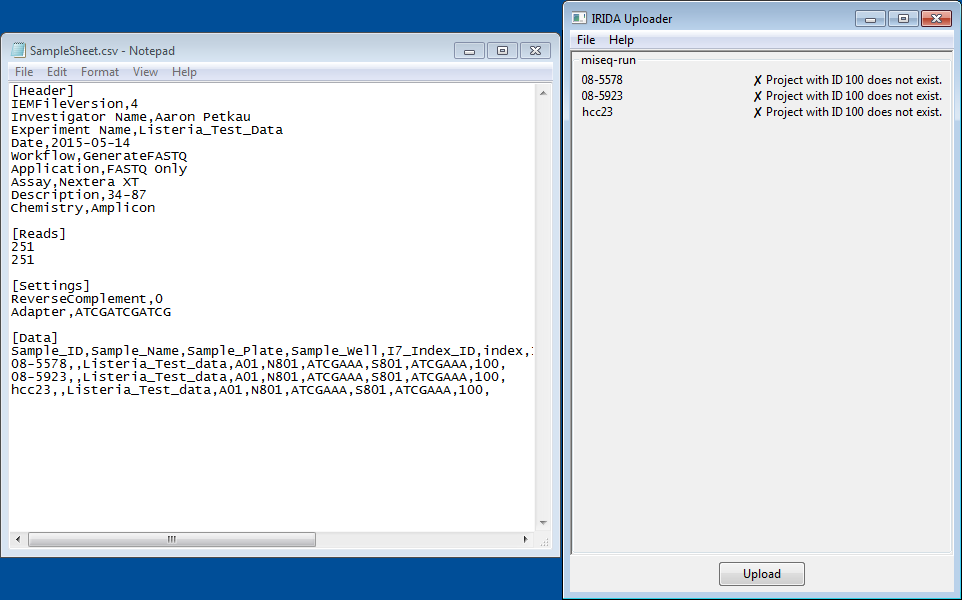
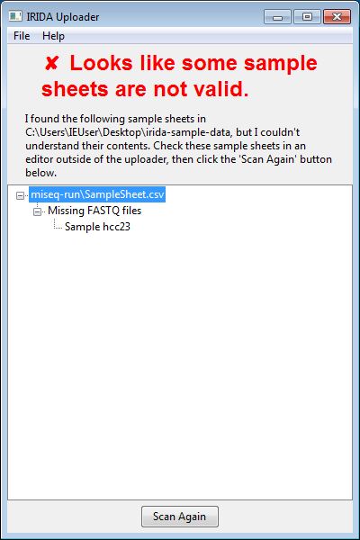

Unfortunately, uploads don't always follow the happy-path. Some errors can be expected to occur, and this part of the guide will help you deal with those errors.

Connectivity issues
===================
Connectivity errors are usually caused by a couple of different issues:

1. The server is not running or is not connectable,
2. The client credentials are not correct or are expired,
3. The user credentials are not correct or are expired.

The server is not running
-------------------------

If the server is down or is not correctly configured, the uploader will not be able to upload data to the server.

You can verify that the server is down by opening the settings dialog and copying the **Server URL** that you have entered, excluding the `/api/` portion at the end, and paste the URL into your web browser. If no web site appears (or a web site other than the IRIDA login or dashboard page appears), then the server is probably down.

**Resolution**: You should get in touch with the administrator of your IRIDA instance to help identify the problem.

During an upload
----------------

If the upload fails during an upload, the uploader will stop uploading data, and tell you which sample failed to be uploaded. Upload failures during an upload can happen for several reasons, most likely either internet connectivity issues or server errors. You can try uploading the data again by clicking the `Try again` button. Clicking the `Try again` button will skip all samples that were successfully uploaded and start with the sample where the failure happened.

**Resolution**: If you still have problems uploading data, you should get in touch with the administrator of your IRIDA instance. The uploader generates detailed logs about what has happened during the upload. The logs are stored at `C:\Users\${YOURUSER}\AppData\Local\iridaUploader\iridaUploader\Logs\irida-uploader.log`. You should include the log file in your communication with the administrator to help figure out what the problem is.

Missing project(s)
==================

The uploader requires a valid IRIDA project ID as a target for where the data should be sent. The project ID belongs in the `Sample_Project` column of `SampleSheet.csv`.

When the uploader encounters a project ID entered in `SampleSheet.csv` that does not exist on the IRIDA server, the uploader will report that the project ID does not exist.

**Resolution**: Find the sample(s) marked in the uploader interface and edit the corresponding rows in `SampleSheet.csv` to use valid project IDs in IRIDA.

Missing sequencing data
=======================

Sometimes the uploader will not be able to find files that correspond to samples in the sample sheet. The uploader searches for files under the folder `Data\Intensities\BaseCalls\`. The prefix of each `.fastq.gz` **must** be one of the `Sample_ID` or (if specified) the `Sample_Name`.

Illumina software will sometimes translate the prefix from the sample sheet if your sample name or ID includes special characters or underscores.

**Resolution**: The names or IDs of samples in `SampleSheet.csv` must match exactly with files in `Data\Intensities\BaseCalls`. You should either rename the samples in `SampleSheet.csv` *without* the special characters and regenerate the `.fastq.gz` files, or you should rename the files under `Data\Intensities\BaseCalls` so that they match the names specified in `SampleSheet.csv`.
