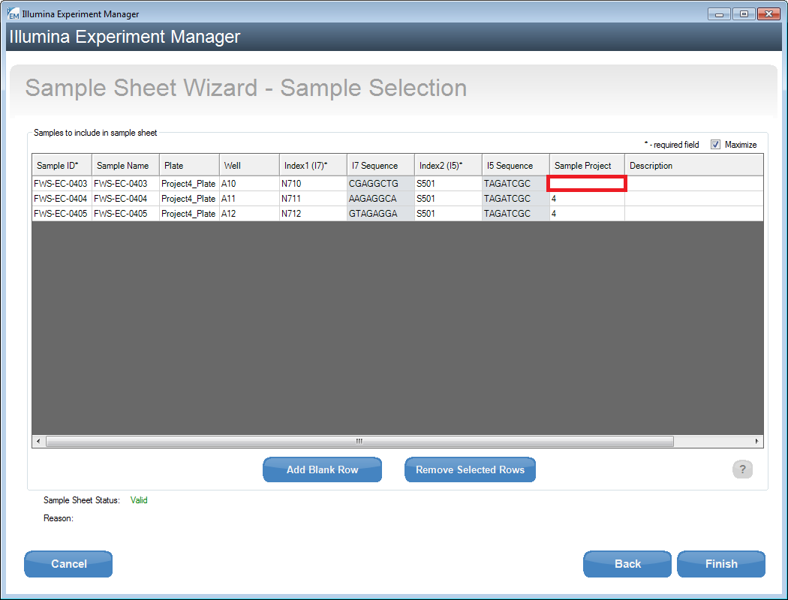
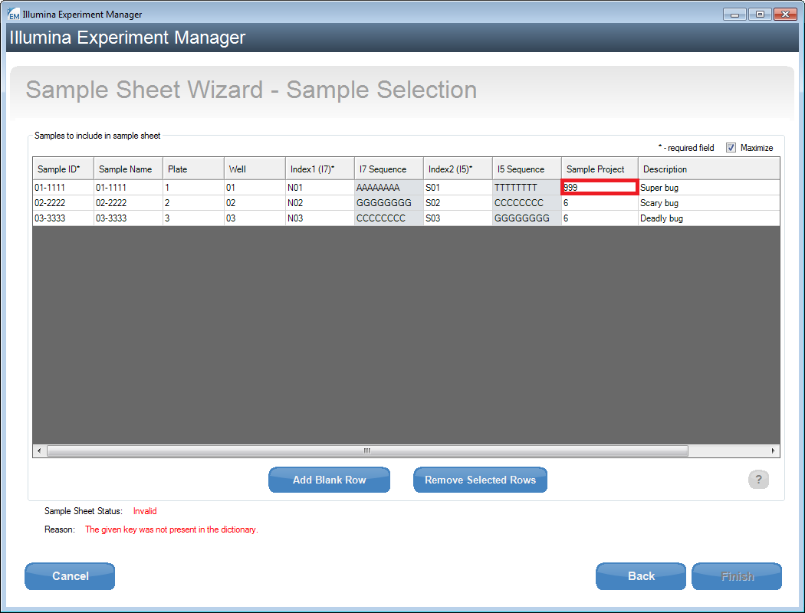
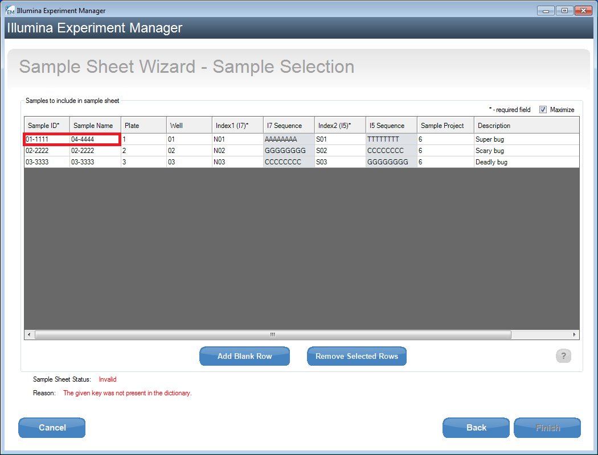

.. _handling_errors:

===============
Handling Errors
===============

SampleSheet errors
------------------

Missing Sample_Project or Sample_Id
^^^^^^^^^^^^^^^^^^^^^^^^^^^^^^^^^^^

Missing Sample_Project

.. image:: _static/handling_errors/missingSampleProject.png
    :target: _static/handling_errors/missingSampleProject.png

Missing Sample_Id

.. image:: _static/handling_errors/missingSampleId.png
    :target: _static/handling_errors/missingSampleId.png

| You can fix either of these errors by editing the `SampleSheet.csv` file
  either with the Illumina Experiment Manager or any text editor.
| Simply fill in the missing value for the indicated field.

e.g:

Updating Sample_Id

.. image:: _static/handling_errors/fixMissingSampleId.png
    :target: _static/handling_errors/fixMissingSampleId.png

Updating Sample_Project

Sample_Project doesn't exist in IRIDA
^^^^^^^^^^^^^^^^^^^^^^^^^^^^^^^^^^^^^

.. image:: _static/handling_errors/projectIdNotInIRIDA.png
    :target: _static/handling_errors/projectIdNotInIRIDA.png

| Check the Sample_Project field for the given Sample_Id in the error message
  to make sure that there are not typos in it.
| If the Sample_Project is correct then contact an IRIDA admin.

Sample_Id does not match Sample_Name
^^^^^^^^^^^^^^^^^^^^^^^^^^^^^^^^^^^^

.. image:: _static/handling_errors/sample_ID_name_mismatch.png
    :target: _static/handling_errors/sample_ID_name_mismatch.png

Edit the `SampleSheet.csv` file to make Sample_Id and Sample_Name be the same values.

**Note**: If the Sample_Name was left blank then it is automatically filled in with the same value as
it's Sample_Id.

Connection error
----------------

.. image:: _static/handling_errors/connectionError.png
    :target: _static/handling_errors/connectionError.png

| The program cannot connect to the given IRIDA URL.
| Go to Options->Settings to view the problem.

There are a few different possibilities to why a connection cannot be made:

  * | The IRIDA server may have been entered incorrectly.
    | Make sure that there are no typos in the IRIDA server URL.
    | If it is correct then the IRIDA server may be down.
    | Contact an IRIDA admin to let them know.

    .. image:: _static/handling_errors/connectionError_URL.png
        :target: _static/handling_errors/connectionError_URL.png

|

  * | The credentials entered may be invalid.
    | Check for typos in the specified field.
    | If the values are correct then contact an IRIDA admin.

    .. image:: _static/handling_errors/connectionError_clientID.png
        :target: _static/handling_errors/connectionError_clientID.png
