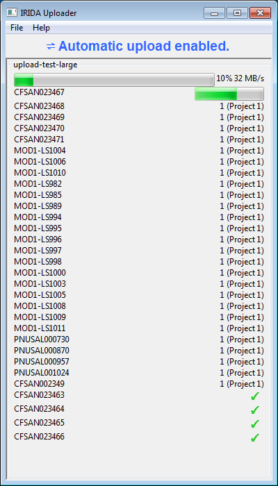
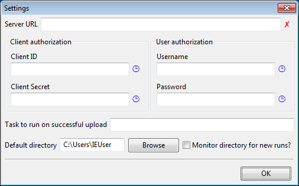
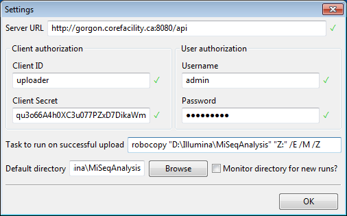
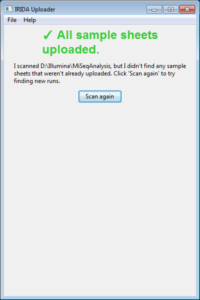
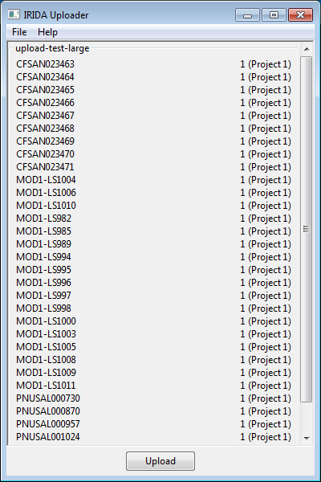
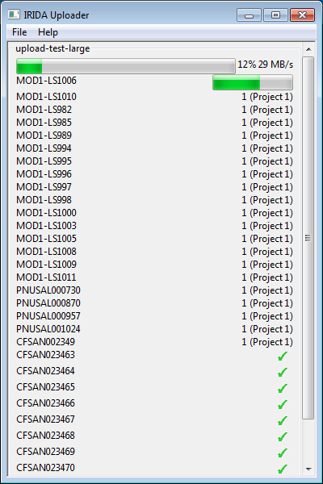
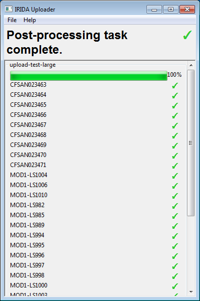

# IRIDA MiSeq Uploader

The IRIDA MiSeq Uploader is a tool built to upload data from the [Illumina MiSeq](http://www.illumina.com/systems/miseq.html) instrument to an [IRIDA](http://irida.ca) server.



## Features
* Resumable uploads -- if the uploader fails due to a connection or server-related issue, the upload can be resumed later without re-uploading data.
* Automated uploads -- the uploader can optionally be configured to monitor an analysis directory for new runs and upload them immediately upon completion.
* Post-processing tasks -- the uploader can optionally be configured to execute post-processing tasks after uploading data, like backing up data to an external location.
* Straightforward user interface -- uploading a new run to an IRIDA server is as simple as clicking the `Upload` button!

## Getting the Uploader
The IRIDA MiSeq Uploader can be run on Microsoft Windows, or any other operating system that supports Python.

You can download pre-built packages for Windows from our [GitHub releases page](https://github.com/phac-nml/irida-miseq-uploader/releases/latest).

You may also run the uploader on Linux or Mac, provided you have access to `pip` and [wxPython](https://wxpython.org/). Instructions for running the uploader on Linux or Mac can be found in our [`README.md` file](https://github.com/phac-nml/irida-miseq-uploader/blob/master/README.md).

## Preparing your sample sheet
Before using the uploader, you must prepare your sequencing run with IRIDA-specific project IDs. You can either enter the project IDs when you're creating your sample sheet using the Illumina Experiment Manager or after creating the sample sheet by editing `SampleSheet.csv` with Microsoft Excel or Windows Notepad.

An example, completed `SampleSheet.csv` with the `Sample_Project` column filled in looks like:

```
[Header]
IEMFileVersion,4
Investigator Name,Investigator 1
Experiment Name,Experiment
Date,2015-05-14
Workflow,GenerateFASTQ
Application,FASTQ Only
Assay,Nextera XT
Description,
Chemistry,Amplicon

[Reads]
251
251

[Settings]
ReverseComplement,0
Adapter,ATCGATCGATCG

[Data]
Sample_ID,Sample_Name,Sample_Plate,Sample_Well,I7_Index_ID,index,I5_Index_ID,index2,Sample_Project,Description
sample1,,plate1,A01,N801,ATCGAAA,S801,ATCGAAA,1,
sample2,,plate1,A01,N801,ATCGAAA,S801,ATCGAAA,1,
sample3,,plate1,A01,N801,ATCGAAA,S801,ATCGAAA,1,
```

## Running the Uploader
Once you've installed the uploader and added project IDs to your sample sheet, you can run the uploader by clicking on the entry created in the Start menu:


## Configuring the Uploader

The first time you run the uploader, you'll be prompted to fill-in some configuration settings:



* The **Server URL** is the API address of your IRIDA server. This address is almost always `http://example.com/irida/api`, where `example.com` is your domain.
* The **Client authorization** section is where you will fill in the OAuth client ID for the uploader. You must create a client in your IRIDA instance using the `password` grant type, and your client must be given both `read` and `write` scopes. You can find out about creating clients in IRIDA in the [Creating a new system client](http://irida.corefacility.ca/documentation/user/administrator/#creating-a-new-system-client) documentation.
* The **User authorization** section is where you will fill in the username and password of the user account that has permission to upload data to IRIDA. The user account **must** be created having the *Sequencer* role.
* The **Task to run on successful upload** field gives you the opportunity to run post-processing scripts on your MiSeq data, after the uploader has finished uploading the data to the IRIDA server. This field can be used, for example, to back up the Illumina data to an external storage area using the Windows utility `robocopy`.
* The **Default directory** field should be used to specify the directory that the uploader will scan when it first starts. If you're running this tool on the MiSeq instrument, you should choose the folder `D:\Illumina\MiSeqAnalysis\`.
    * The option **Monitor directory for new runs?** can be used to automate uploading newly completed runs to the IRIDA server. **WARNING**: For this feature to work, you must leave the IRIDA MiSeq Uploader tool running *during* the sequencing process. While this feature has been tested extensively, Illumina discourages running any non-Illumina software on the machine while the sequencing process is running.

The settings dialog will verify the information you're entering as you type it in. If you've entered everything correctly, your settings dialog should have green checkmark icons <span style='color: green'>✓</span> beside each of the authorization fields:



If anything is incorrectly entered, you'll see a red cross icon <span style='color: red'>✘</span>.

# Uploader Interfaces
After you've finished configuring the IRIDA MiSeq Uploader, the first screen you will see will tell you that no new data has been found to upload:



If you launch the uploader when the directory `D:\Illumina\MiSeqAnalysis\` has sequencing data, then you'll see a list of the runs that the uploader discovered, along with a list of the samples in each run and the name of the project that each sample is going to be uploaded to on the IRIDA server:



When a new run is found, click the `Upload` button!



As each sample completes uploading to the server, it's moved to the bottom of the list of samples with a green checkmark <span style='color: green'>✓</span>indicating that the upload succeeded.

When the run is complete, all samples will have a green checkmark <span style='color: green'>✓</span> beside them, and the overall run progress bar will show 100% progress:




testadd
